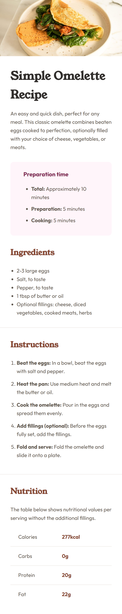

# 🥚 Simple Omelette Recipe Page

This is a solution to the [Frontend Mentor](https://www.frontendmentor.io/challenges/recipe-page-KiTsR8QQKm) challenge: **Recipe page main**.  
It displays a clean and responsive recipe page for a simple omelette using HTML and CSS.

## 📸 Screenshot

## 🔗 Live Demo

Check it out live here: [View Project](https://telmomanduco.github.io/recipe-page-main/)

## 💻 Built With

- Semantic HTML5
- CSS3
- Flexbox & Media Queries
- Google Fonts (Young Serif & Outfit)

## 📱 Responsive

The layout is responsive and works on both mobile and desktop screens.

## 📂 What I Learned

- How to use semantic tags (`<section>`, `<article>`, `<table>`, etc.)
- Applying custom fonts with Google Fonts
- Creating a responsive layout using media queries
- Styling a table for nutritional information
